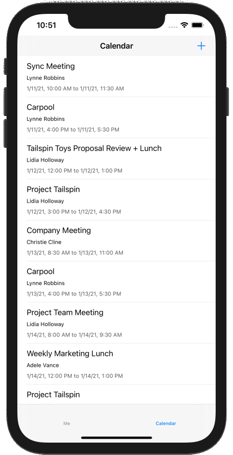

<!-- markdownlint-disable MD002 MD041 -->

<span data-ttu-id="a788a-101">En este ejercicio, incorporará Microsoft Graph a la aplicación.</span><span class="sxs-lookup"><span data-stu-id="a788a-101">In this exercise you will incorporate the Microsoft Graph into the application.</span></span> <span data-ttu-id="a788a-102">Para esta aplicación, usará el [SDK de Microsoft Graph para Objective C](https://github.com/microsoftgraph/msgraph-sdk-objc) para realizar llamadas a Microsoft Graph.</span><span class="sxs-lookup"><span data-stu-id="a788a-102">For this application, you will use the [Microsoft Graph SDK for Objective C](https://github.com/microsoftgraph/msgraph-sdk-objc) to make calls to Microsoft Graph.</span></span>

## <a name="get-calendar-events-from-outlook"></a><span data-ttu-id="a788a-103">Obtener eventos de calendario de Outlook</span><span class="sxs-lookup"><span data-stu-id="a788a-103">Get calendar events from Outlook</span></span>

<span data-ttu-id="a788a-104">En esta sección, ampliará la `GraphManager` clase para agregar una función para obtener los eventos del usuario y actualizar `CalendarViewController` para usar estas funciones nuevas.</span><span class="sxs-lookup"><span data-stu-id="a788a-104">In this section you will extend the `GraphManager` class to add a function to get the user's events and update `CalendarViewController` to use these new functions.</span></span>

1. <span data-ttu-id="a788a-105">Abra **GraphManager. h** y agregue el siguiente código sobre la `@interface` declaración.</span><span class="sxs-lookup"><span data-stu-id="a788a-105">Open **GraphManager.h** and add the following code above the `@interface` declaration.</span></span>

    ```objc
    typedef void (^GetEventsCompletionBlock)(NSData* _Nullable data, NSError* _Nullable error);
    ```

1. <span data-ttu-id="a788a-106">Agregue el siguiente código a la `@interface` declaración.</span><span class="sxs-lookup"><span data-stu-id="a788a-106">Add the following code to the `@interface` declaration.</span></span>

    ```objc
    - (void) getEventsWithCompletionBlock: (GetEventsCompletionBlock)completionBlock;
    ```

1. <span data-ttu-id="a788a-107">Abra **GraphManager. m** y agregue la siguiente función a la `GraphManager` clase.</span><span class="sxs-lookup"><span data-stu-id="a788a-107">Open **GraphManager.m** and add the following function to the `GraphManager` class.</span></span>

    ```objc
    - (void) getEventsWithCompletionBlock:(GetEventsCompletionBlock)completionBlock {
        // GET /me/events?$select='subject,organizer,start,end'$orderby=createdDateTime DESC
        NSString* eventsUrlString =
        [NSString stringWithFormat:@"%@/me/events?%@&%@",
         MSGraphBaseURL,
         // Only return these fields in results
         @"$select=subject,organizer,start,end",
         // Sort results by when they were created, newest first
         @"$orderby=createdDateTime+DESC"];

        NSURL* eventsUrl = [[NSURL alloc] initWithString:eventsUrlString];
        NSMutableURLRequest* eventsRequest = [[NSMutableURLRequest alloc] initWithURL:eventsUrl];

        MSURLSessionDataTask* eventsDataTask =
        [[MSURLSessionDataTask alloc]
         initWithRequest:eventsRequest
         client:self.graphClient
         completion:^(NSData *data, NSURLResponse *response, NSError *error) {
             if (error) {
                 completionBlock(nil, error);
                 return;
             }

             // TEMPORARY
             completionBlock(data, nil);
         }];

        // Execute the request
        [eventsDataTask execute];
    }
    ```

    > [!NOTE]
    > <span data-ttu-id="a788a-108">Tenga en cuenta lo que `getEventsWithCompletionBlock` hace el código.</span><span class="sxs-lookup"><span data-stu-id="a788a-108">Consider what the code in `getEventsWithCompletionBlock` is doing.</span></span>
    >
    > - <span data-ttu-id="a788a-109">La dirección URL a la que se `/v1.0/me/events`llamará es.</span><span class="sxs-lookup"><span data-stu-id="a788a-109">The URL that will be called is `/v1.0/me/events`.</span></span>
    > - <span data-ttu-id="a788a-110">El `select` parámetro de consulta limita los campos devueltos para cada evento a solo aquellos que la aplicación usará realmente.</span><span class="sxs-lookup"><span data-stu-id="a788a-110">The `select` query parameter limits the fields returned for each events to just those the app will actually use.</span></span>
    > - <span data-ttu-id="a788a-111">El `orderby` parámetro de consulta ordena los resultados por la fecha y hora en que se crearon, con el elemento más reciente en primer lugar.</span><span class="sxs-lookup"><span data-stu-id="a788a-111">The `orderby` query parameter sorts the results by the date and time they were created, with the most recent item being first.</span></span>

1. <span data-ttu-id="a788a-112">Abra **CalendarViewController. m** y reemplace todo su contenido por el código siguiente.</span><span class="sxs-lookup"><span data-stu-id="a788a-112">Open **CalendarViewController.m** and replace its entire contents with the following code.</span></span>

    ```objc
    #import "CalendarViewController.h"
    #import "SpinnerViewController.h"
    #import "GraphManager.h"
    #import <MSGraphClientModels/MSGraphClientModels.h>

    @interface CalendarViewController ()

    @property SpinnerViewController* spinner;

    @end

    @implementation CalendarViewController

    - (void)viewDidLoad {
        [super viewDidLoad];
        // Do any additional setup after loading the view.

        self.spinner = [SpinnerViewController alloc];
        [self.spinner startWithContainer:self];

        [GraphManager.instance
         getEventsWithCompletionBlock:^(NSData * _Nullable data, NSError * _Nullable error) {
             dispatch_async(dispatch_get_main_queue(), ^{
                 [self.spinner stop];

                 if (error) {
                     // Show the error
                     UIAlertController* alert = [UIAlertController
                                                 alertControllerWithTitle:@"Error getting events"
                                                 message:error.debugDescription
                                                 preferredStyle:UIAlertControllerStyleAlert];

                     UIAlertAction* okButton = [UIAlertAction
                                                actionWithTitle:@"OK"
                                                style:UIAlertActionStyleDefault
                                                handler:nil];

                     [alert addAction:okButton];
                     [self presentViewController:alert animated:true completion:nil];
                     return;
                 }

                 // TEMPORARY
                 self.calendarJSON.text = [[NSString alloc] initWithData:data encoding:NSUTF8StringEncoding];
                 [self.calendarJSON sizeToFit];
             });
         }];
    }

    @end
    ```

1. <span data-ttu-id="a788a-113">Ejecute la aplicación, inicie sesión y puntee en el elemento de navegación **calendario** del menú.</span><span class="sxs-lookup"><span data-stu-id="a788a-113">Run the app, sign in, and tap the **Calendar** navigation item in the menu.</span></span> <span data-ttu-id="a788a-114">Debería ver un volcado JSON de los eventos en la aplicación.</span><span class="sxs-lookup"><span data-stu-id="a788a-114">You should see a JSON dump of the events in the app.</span></span>

## <a name="display-the-results"></a><span data-ttu-id="a788a-115">Mostrar los resultados</span><span class="sxs-lookup"><span data-stu-id="a788a-115">Display the results</span></span>

<span data-ttu-id="a788a-116">Ahora puede reemplazar el volcado de JSON con algo para mostrar los resultados de forma fácil de uso.</span><span class="sxs-lookup"><span data-stu-id="a788a-116">Now you can replace the JSON dump with something to display the results in a user-friendly manner.</span></span> <span data-ttu-id="a788a-117">En esta sección, modificará la `getEventsWithCompletionBlock` función para que devuelva objetos con establecimiento inflexible de tipos `CalendarViewController` y lo modifique para usar una vista de tabla para representar los eventos.</span><span class="sxs-lookup"><span data-stu-id="a788a-117">In this section, you will modify the `getEventsWithCompletionBlock` function to return strongly-typed objects, and modify `CalendarViewController` to use a table view to render the events.</span></span>

### <a name="update-getevents"></a><span data-ttu-id="a788a-118">Actualizar getEvents</span><span class="sxs-lookup"><span data-stu-id="a788a-118">Update getEvents</span></span>

1. <span data-ttu-id="a788a-119">Abra **GraphManager. h**.</span><span class="sxs-lookup"><span data-stu-id="a788a-119">Open **GraphManager.h**.</span></span> <span data-ttu-id="a788a-120">Cambie la `GetEventsCompletionBlock` definición de tipo por la siguiente.</span><span class="sxs-lookup"><span data-stu-id="a788a-120">Change the `GetEventsCompletionBlock` type definition to the following.</span></span>

    ```objc
    typedef void (^GetEventsCompletionBlock)(NSArray<MSGraphEvent*>* _Nullable events, NSError* _Nullable error);
    ```

1. <span data-ttu-id="a788a-121">Abra **GraphManager. m**.</span><span class="sxs-lookup"><span data-stu-id="a788a-121">Open **GraphManager.m**.</span></span> <span data-ttu-id="a788a-122">Reemplace la `completionBlock(data, nil);` línea en la `getEventsWithCompletionBlock` función por el siguiente código.</span><span class="sxs-lookup"><span data-stu-id="a788a-122">Replace the `completionBlock(data, nil);` line in the `getEventsWithCompletionBlock` function with the following code.</span></span>

    :::code language="objc" source="../demo/GraphTutorial/GraphTutorial/GraphManager.m" id="GetEventsSnippet" highlight="24-43":::

### <a name="update-calendarviewcontroller"></a><span data-ttu-id="a788a-123">Actualizar CalendarViewController</span><span class="sxs-lookup"><span data-stu-id="a788a-123">Update CalendarViewController</span></span>

1. <span data-ttu-id="a788a-124">Cree un nuevo archivo de **clase táctil de cacao** en el proyecto `CalendarTableViewCell` **GraphTutorial** denominado.</span><span class="sxs-lookup"><span data-stu-id="a788a-124">Create a new **Cocoa Touch Class** file in the **GraphTutorial** project named `CalendarTableViewCell`.</span></span> <span data-ttu-id="a788a-125">Elija **UITableViewCell** en el campo **subclase de** .</span><span class="sxs-lookup"><span data-stu-id="a788a-125">Choose **UITableViewCell** in the **Subclass of** field.</span></span>
1. <span data-ttu-id="a788a-126">Abra **CalendarTableViewCell. h** y reemplace su contenido por el código siguiente.</span><span class="sxs-lookup"><span data-stu-id="a788a-126">Open **CalendarTableViewCell.h** and replace its contents with the following code.</span></span>

    :::code language="objc" source="../demo/GraphTutorial/GraphTutorial/CalendarTableViewCell.h" id="CalendarTableCellSnippet":::

1. <span data-ttu-id="a788a-127">Abra **CalendarTableViewCell. m** y reemplace su contenido por el código siguiente.</span><span class="sxs-lookup"><span data-stu-id="a788a-127">Open **CalendarTableViewCell.m** and replace its contents with the following code.</span></span>

    :::code language="objc" source="../demo/GraphTutorial/GraphTutorial/CalendarTableViewCell.m" id="CalendarTableCellSnippet":::

1. <span data-ttu-id="a788a-128">Abra **Main. Storyboard** y busque la **escena del calendario**.</span><span class="sxs-lookup"><span data-stu-id="a788a-128">Open **Main.storyboard** and locate the **Calendar Scene**.</span></span> <span data-ttu-id="a788a-129">Seleccione la **vista** de la **escena del calendario** y elimínela.</span><span class="sxs-lookup"><span data-stu-id="a788a-129">Select the **View** in the **Calendar Scene** and delete it.</span></span>

    

1. <span data-ttu-id="a788a-131">Agregue una **vista de tabla** de la **biblioteca** a la **escena del calendario**.</span><span class="sxs-lookup"><span data-stu-id="a788a-131">Add a **Table View** from the **Library** to the **Calendar Scene**.</span></span>
1. <span data-ttu-id="a788a-132">Seleccione la vista de tabla y, a continuación, seleccione el **Inspector de atributos**.</span><span class="sxs-lookup"><span data-stu-id="a788a-132">Select the table view, then select the **Attributes Inspector**.</span></span> <span data-ttu-id="a788a-133">Establezca **las celdas del prototipo** en **1**.</span><span class="sxs-lookup"><span data-stu-id="a788a-133">Set **Prototype Cells** to **1**.</span></span>
1. <span data-ttu-id="a788a-134">Use la **biblioteca** para agregar tres **etiquetas** a la celda del prototipo.</span><span class="sxs-lookup"><span data-stu-id="a788a-134">Use the **Library** to add three **Labels** to the prototype cell.</span></span>
1. <span data-ttu-id="a788a-135">Seleccione la celda prototype y, a continuación, seleccione el **Inspector de identidad**.</span><span class="sxs-lookup"><span data-stu-id="a788a-135">Select the prototype cell, then select the **Identity Inspector**.</span></span> <span data-ttu-id="a788a-136">Cambie la **clase** a **CalendarTableViewCell**.</span><span class="sxs-lookup"><span data-stu-id="a788a-136">Change **Class** to **CalendarTableViewCell**.</span></span>
1. <span data-ttu-id="a788a-137">Seleccione el **Inspector de atributos** y establezca **identificador** en `EventCell`.</span><span class="sxs-lookup"><span data-stu-id="a788a-137">Select the **Attributes Inspector** and set **Identifier** to `EventCell`.</span></span>
1. <span data-ttu-id="a788a-138">Con la **EventCell** seleccionada, seleccione el **Inspector de conexiones** y `durationLabel`Conéctese `organizerLabel`, `subjectLabel` y a las etiquetas que haya agregado a la celda en el guión gráfico.</span><span class="sxs-lookup"><span data-stu-id="a788a-138">With the **EventCell** selected, select the **Connections Inspector** and connect `durationLabel`, `organizerLabel`, and `subjectLabel` to the labels you added to the cell on the storyboard.</span></span>
1. <span data-ttu-id="a788a-139">Establezca las propiedades y restricciones de las tres etiquetas como se indica a continuación.</span><span class="sxs-lookup"><span data-stu-id="a788a-139">Set the properties and constraints on the three labels as follows.</span></span>

    - <span data-ttu-id="a788a-140">**Etiqueta de asunto**</span><span class="sxs-lookup"><span data-stu-id="a788a-140">**Subject Label**</span></span>
        - <span data-ttu-id="a788a-141">Agregar restricción: espacio inicial para la vista de contenido margen inicial, valor: 0</span><span class="sxs-lookup"><span data-stu-id="a788a-141">Add constraint: Leading space to Content View Leading Margin, value: 0</span></span>
        - <span data-ttu-id="a788a-142">Agregar restricción: espacio final para la vista de contenido margen final, valor: 0</span><span class="sxs-lookup"><span data-stu-id="a788a-142">Add constraint: Trailing space to Content View Trailing Margin, value: 0</span></span>
        - <span data-ttu-id="a788a-143">Agregar restricción: espacio superior para la vista de contenido margen superior, valor: 0</span><span class="sxs-lookup"><span data-stu-id="a788a-143">Add constraint: Top space to Content View Top Margin, value: 0</span></span>
    - <span data-ttu-id="a788a-144">**Etiqueta del organizador**</span><span class="sxs-lookup"><span data-stu-id="a788a-144">**Organizer Label**</span></span>
        - <span data-ttu-id="a788a-145">Fuente: sistema 12,0</span><span class="sxs-lookup"><span data-stu-id="a788a-145">Font: System 12.0</span></span>
        - <span data-ttu-id="a788a-146">Agregar restricción: espacio inicial para la vista de contenido margen inicial, valor: 0</span><span class="sxs-lookup"><span data-stu-id="a788a-146">Add constraint: Leading space to Content View Leading Margin, value: 0</span></span>
        - <span data-ttu-id="a788a-147">Agregar restricción: espacio final para la vista de contenido margen final, valor: 0</span><span class="sxs-lookup"><span data-stu-id="a788a-147">Add constraint: Trailing space to Content View Trailing Margin, value: 0</span></span>
        - <span data-ttu-id="a788a-148">Agregar restricción: espacio superior a etiqueta de asunto en la parte inferior, valor: estándar</span><span class="sxs-lookup"><span data-stu-id="a788a-148">Add constraint: Top space to Subject Label Bottom, value: Standard</span></span>
    - <span data-ttu-id="a788a-149">**Etiqueta de duración**</span><span class="sxs-lookup"><span data-stu-id="a788a-149">**Duration Label**</span></span>
        - <span data-ttu-id="a788a-150">Fuente: sistema 12,0</span><span class="sxs-lookup"><span data-stu-id="a788a-150">Font: System 12.0</span></span>
        - <span data-ttu-id="a788a-151">Color: color gris oscuro</span><span class="sxs-lookup"><span data-stu-id="a788a-151">Color: Dark Gray Color</span></span>
        - <span data-ttu-id="a788a-152">Agregar restricción: espacio inicial para la vista de contenido margen inicial, valor: 0</span><span class="sxs-lookup"><span data-stu-id="a788a-152">Add constraint: Leading space to Content View Leading Margin, value: 0</span></span>
        - <span data-ttu-id="a788a-153">Agregar restricción: espacio final para la vista de contenido margen final, valor: 0</span><span class="sxs-lookup"><span data-stu-id="a788a-153">Add constraint: Trailing space to Content View Trailing Margin, value: 0</span></span>
        - <span data-ttu-id="a788a-154">Agregar restricción: espacio superior para etiqueta de Organizer en la parte inferior, valor: estándar</span><span class="sxs-lookup"><span data-stu-id="a788a-154">Add constraint: Top space to Organizer Label Bottom, value: Standard</span></span>
        - <span data-ttu-id="a788a-155">Agregar restricción: espacio inferior para la vista de contenido margen inferior, valor: 8</span><span class="sxs-lookup"><span data-stu-id="a788a-155">Add constraint: Bottom space to Content View Bottom Margin, value: 8</span></span>

    

1. <span data-ttu-id="a788a-157">Abra **CalendarViewController. h** y quite la `calendarJSON` propiedad.</span><span class="sxs-lookup"><span data-stu-id="a788a-157">Open **CalendarViewController.h** and remove the `calendarJSON` property.</span></span>
1. <span data-ttu-id="a788a-158">Cambie la `@interface` declaración a la siguiente.</span><span class="sxs-lookup"><span data-stu-id="a788a-158">Change the `@interface` declaration to the following.</span></span>

    ```objc
    @interface CalendarViewController : UITableViewController
    ```

1. <span data-ttu-id="a788a-159">Abra **CalendarViewController. m** y reemplace su contenido por el código siguiente.</span><span class="sxs-lookup"><span data-stu-id="a788a-159">Open **CalendarViewController.m** and replace its contents with the following code.</span></span>

    :::code language="objc" source="../demo/GraphTutorial/GraphTutorial/CalendarViewController.m" id="CalendarViewSnippet":::

1. <span data-ttu-id="a788a-160">Ejecute la aplicación, inicie sesión y pulse la pestaña **calendario** . Debe ver la lista de eventos.</span><span class="sxs-lookup"><span data-stu-id="a788a-160">Run the app, sign in, and tap the **Calendar** tab. You should see the list of events.</span></span>

    
