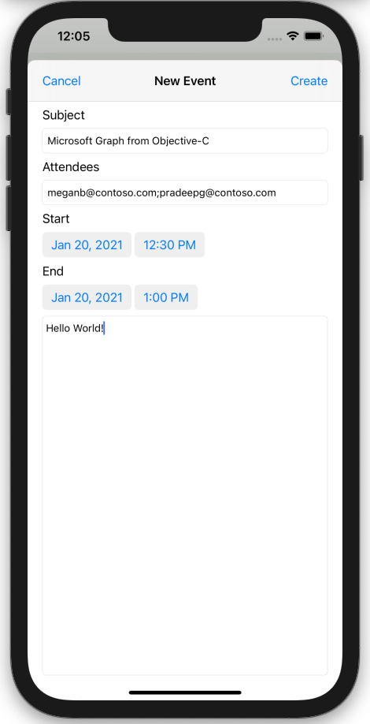

<!-- markdownlint-disable MD002 MD041 -->

<span data-ttu-id="00362-101">En esta sección agregará la capacidad de crear eventos en el calendario del usuario.</span><span class="sxs-lookup"><span data-stu-id="00362-101">In this section you will add the ability to create events on the user's calendar.</span></span>

1. <span data-ttu-id="00362-102">Abra **GraphManager.h y** agregue el siguiente código encima de la `@interface` declaración.</span><span class="sxs-lookup"><span data-stu-id="00362-102">Open **GraphManager.h** and add the following code above the `@interface` declaration.</span></span>

    ```objc
    typedef void (^CreateEventCompletionBlock)(MSGraphEvent* _Nullable event,
                                               NSError* _Nullable error);
    ```

1. <span data-ttu-id="00362-103">Agregue el siguiente código a la `@interface` declaración.</span><span class="sxs-lookup"><span data-stu-id="00362-103">Add the following code to the `@interface` declaration.</span></span>

    ```objc
    - (void) createEventWithSubject: (NSString*) subject
                           andStart: (NSDate*) start
                             andEnd: (NSDate*) end
                       andAttendees: (NSArray<NSString*>* _Nullable) attendees
                            andBody: (NSString* _Nullable) body
                 andCompletionBlock: (CreateEventCompletionBlock) completion;
    ```

1. <span data-ttu-id="00362-104">Abra **GraphManager.m** y agregue la siguiente función para crear un nuevo evento en el calendario del usuario.</span><span class="sxs-lookup"><span data-stu-id="00362-104">Open **GraphManager.m** and add the following function to create a new event on the user's calendar.</span></span>

    :::code language="objc" source="../demo/GraphTutorial/GraphTutorial/GraphManager.m" id="CreateEventSnippet":::

1. <span data-ttu-id="00362-105">Cree un nuevo **archivo de clase Cocoa Touch** en la carpeta **GraphTutorial** denominada `NewEventViewController` .</span><span class="sxs-lookup"><span data-stu-id="00362-105">Create a new **Cocoa Touch Class** file in the **GraphTutorial** folder named `NewEventViewController`.</span></span> <span data-ttu-id="00362-106">Elija **UIViewController** en la **subclase del** campo.</span><span class="sxs-lookup"><span data-stu-id="00362-106">Choose **UIViewController** in the **Subclass of** field.</span></span>
1. <span data-ttu-id="00362-107">Abre **NewEventViewController.h** y agrega el siguiente código dentro de la `@interface` declaración.</span><span class="sxs-lookup"><span data-stu-id="00362-107">Open **NewEventViewController.h** and add the following code inside the `@interface` declaration.</span></span>

    ```objectivec
    @property (nonatomic) IBOutlet UITextField* subject;
    @property (nonatomic) IBOutlet UITextField* attendees;
    @property (nonatomic) IBOutlet UIDatePicker* start;
    @property (nonatomic) IBOutlet UIDatePicker* end;
    @property (nonatomic) IBOutlet UITextView* body;
    ```

1. <span data-ttu-id="00362-108">Abra **NewEventController.m y** reemplace su contenido por el código siguiente.</span><span class="sxs-lookup"><span data-stu-id="00362-108">Open **NewEventController.m** and replace its contents with the following code.</span></span>

    :::code language="objc" source="../demo/GraphTutorial/GraphTutorial/NewEventViewController.m" id="NewEventViewControllerSnippet":::

1. <span data-ttu-id="00362-109">Abra **Main.storyboard**.</span><span class="sxs-lookup"><span data-stu-id="00362-109">Open **Main.storyboard**.</span></span> <span data-ttu-id="00362-110">Usa la **biblioteca para** arrastrar un controlador **de vista** al guión gráfico.</span><span class="sxs-lookup"><span data-stu-id="00362-110">Use the **Library** to drag a **View Controller** onto the storyboard.</span></span>
1. <span data-ttu-id="00362-111">Mediante la **biblioteca,** agregue una **barra de navegación** al controlador de vista.</span><span class="sxs-lookup"><span data-stu-id="00362-111">Using the **Library**, add a **Navigation Bar** to the view controller.</span></span>
1. <span data-ttu-id="00362-112">Haga doble clic en **el título** de la barra de navegación y actualíquelo a `New Event` .</span><span class="sxs-lookup"><span data-stu-id="00362-112">Double-click the **Title** in the navigation bar and update it to `New Event`.</span></span>
1. <span data-ttu-id="00362-113">Mediante la **biblioteca,** agregue un elemento **de botón** de barra a la izquierda de la barra de navegación.</span><span class="sxs-lookup"><span data-stu-id="00362-113">Using the **Library**, add a **Bar Button Item** to the left-hand side of the navigation bar.</span></span>
1. <span data-ttu-id="00362-114">Seleccione el botón nueva barra y, a continuación, seleccione el **Inspector de atributos.**</span><span class="sxs-lookup"><span data-stu-id="00362-114">Select the new bar button, then select the **Attributes Inspector**.</span></span> <span data-ttu-id="00362-115">Cambiar **título** a `Cancel` .</span><span class="sxs-lookup"><span data-stu-id="00362-115">Change **Title** to `Cancel`.</span></span>
1. <span data-ttu-id="00362-116">Mediante la **biblioteca,** agregue un elemento **de botón** de barra a la derecha de la barra de navegación.</span><span class="sxs-lookup"><span data-stu-id="00362-116">Using the **Library**, add a **Bar Button Item** to the right-hand side of the navigation bar.</span></span>
1. <span data-ttu-id="00362-117">Seleccione el botón nueva barra y, a continuación, seleccione el **Inspector de atributos.**</span><span class="sxs-lookup"><span data-stu-id="00362-117">Select the new bar button, then select the **Attributes Inspector**.</span></span> <span data-ttu-id="00362-118">Cambiar **título** a `Create` .</span><span class="sxs-lookup"><span data-stu-id="00362-118">Change **Title** to `Create`.</span></span>
1. <span data-ttu-id="00362-119">Seleccione el controlador de vista y, a continuación, seleccione **el Inspector de identidad.**</span><span class="sxs-lookup"><span data-stu-id="00362-119">Select the view controller, then select the **Identity Inspector**.</span></span> <span data-ttu-id="00362-120">Cambiar **clase** a **NewEventViewController**.</span><span class="sxs-lookup"><span data-stu-id="00362-120">Change **Class** to **NewEventViewController**.</span></span>
1. <span data-ttu-id="00362-121">Agregue los siguientes controles de la **biblioteca** a la vista.</span><span class="sxs-lookup"><span data-stu-id="00362-121">Add the following controls from the **Library** to the view.</span></span>

    - <span data-ttu-id="00362-122">Agregue una **etiqueta debajo** de la barra de navegación.</span><span class="sxs-lookup"><span data-stu-id="00362-122">Add a **Label** under the navigation bar.</span></span> <span data-ttu-id="00362-123">Establezca su texto en `Subject` .</span><span class="sxs-lookup"><span data-stu-id="00362-123">Set its text to `Subject`.</span></span>
    - <span data-ttu-id="00362-124">Agregue un **campo de texto** bajo la etiqueta.</span><span class="sxs-lookup"><span data-stu-id="00362-124">Add a **Text Field** under the label.</span></span> <span data-ttu-id="00362-125">Establezca su **atributo Placeholder** en `Subject` .</span><span class="sxs-lookup"><span data-stu-id="00362-125">Set its **Placeholder** attribute to `Subject`.</span></span>
    - <span data-ttu-id="00362-126">Agregue una **etiqueta bajo** el campo de texto.</span><span class="sxs-lookup"><span data-stu-id="00362-126">Add a **Label** under the text field.</span></span> <span data-ttu-id="00362-127">Establezca su texto en `Attendees` .</span><span class="sxs-lookup"><span data-stu-id="00362-127">Set its text to `Attendees`.</span></span>
    - <span data-ttu-id="00362-128">Agregue un **campo de texto** bajo la etiqueta.</span><span class="sxs-lookup"><span data-stu-id="00362-128">Add a **Text Field** under the label.</span></span> <span data-ttu-id="00362-129">Establezca su atributo **placeholder** en `Separate multiple entries with ;` .</span><span class="sxs-lookup"><span data-stu-id="00362-129">Set its **Placeholder** attribute to `Separate multiple entries with ;`.</span></span>
    - <span data-ttu-id="00362-130">Agregue una **etiqueta bajo** el campo de texto.</span><span class="sxs-lookup"><span data-stu-id="00362-130">Add a **Label** under the text field.</span></span> <span data-ttu-id="00362-131">Establezca su texto en `Start` .</span><span class="sxs-lookup"><span data-stu-id="00362-131">Set its text to `Start`.</span></span>
    - <span data-ttu-id="00362-132">Agregue un **selector de fecha** bajo la etiqueta.</span><span class="sxs-lookup"><span data-stu-id="00362-132">Add a **Date Picker** under the label.</span></span> <span data-ttu-id="00362-133">Establezca su **estilo preferido en** **Compacto**, su **intervalo** **en 15** minutos y su alto en **35**.</span><span class="sxs-lookup"><span data-stu-id="00362-133">Set its **Preferred Style** to **Compact**, its **Interval** to **15 minutes**, and its height to **35**.</span></span>
    - <span data-ttu-id="00362-134">Agregue una **etiqueta bajo** el selector de fecha.</span><span class="sxs-lookup"><span data-stu-id="00362-134">Add a **Label** under the date picker.</span></span> <span data-ttu-id="00362-135">Establezca su texto en `End` .</span><span class="sxs-lookup"><span data-stu-id="00362-135">Set its text to `End`.</span></span>
    - <span data-ttu-id="00362-136">Agregue un **selector de fecha** bajo la etiqueta.</span><span class="sxs-lookup"><span data-stu-id="00362-136">Add a **Date Picker** under the label.</span></span> <span data-ttu-id="00362-137">Establezca su **estilo preferido en** **Compacto**, su **intervalo** **en 15** minutos y su alto en **35**.</span><span class="sxs-lookup"><span data-stu-id="00362-137">Set its **Preferred Style** to **Compact**, its **Interval** to **15 minutes**, and its height to **35**.</span></span>
    - <span data-ttu-id="00362-138">Agregue una **vista de texto bajo** el selector de fecha.</span><span class="sxs-lookup"><span data-stu-id="00362-138">Add a **Text View** under the date picker.</span></span>

1. <span data-ttu-id="00362-139">Seleccione el **nuevo controlador de vista de eventos** y use el Inspector **de** conexión para realizar las siguientes conexiones.</span><span class="sxs-lookup"><span data-stu-id="00362-139">Select the **New Event View Controller** and use the **Connection Inspector** to make the following connections.</span></span>

    - <span data-ttu-id="00362-140">Conecte la **acción de** cancelación recibida al **botón Cancelar** barra.</span><span class="sxs-lookup"><span data-stu-id="00362-140">Connect the **cancel** received action to the **Cancel** bar button.</span></span>
    - <span data-ttu-id="00362-141">Conecte la **acción createEvent** recibida al **botón Crear** barra.</span><span class="sxs-lookup"><span data-stu-id="00362-141">Connect the **createEvent** received action to the **Create** bar button.</span></span>
    - <span data-ttu-id="00362-142">Conecte la **salida del asunto** al primer campo de texto.</span><span class="sxs-lookup"><span data-stu-id="00362-142">Connect the **subject** outlet to the first text field.</span></span>
    - <span data-ttu-id="00362-143">Conecte la **salida de asistentes** al segundo campo de texto.</span><span class="sxs-lookup"><span data-stu-id="00362-143">Connect the **attendees** outlet to the second text field.</span></span>
    - <span data-ttu-id="00362-144">Conecta la **salida de** inicio al primer selector de fecha.</span><span class="sxs-lookup"><span data-stu-id="00362-144">Connect the **start** outlet to the first date picker.</span></span>
    - <span data-ttu-id="00362-145">Conecte la **salida final** al segundo selector de fecha.</span><span class="sxs-lookup"><span data-stu-id="00362-145">Connect the **end** outlet to the second date picker.</span></span>
    - <span data-ttu-id="00362-146">Conecte la **salida del cuerpo** a la vista de texto.</span><span class="sxs-lookup"><span data-stu-id="00362-146">Connect the **body** outlet to the text view.</span></span>

1. <span data-ttu-id="00362-147">Agregue las siguientes restricciones.</span><span class="sxs-lookup"><span data-stu-id="00362-147">Add the following constraints.</span></span>

    - <span data-ttu-id="00362-148">**Barra de navegación**</span><span class="sxs-lookup"><span data-stu-id="00362-148">**Navigation Bar**</span></span>
        - <span data-ttu-id="00362-149">Espacio inicial a Área segura, valor: 0</span><span class="sxs-lookup"><span data-stu-id="00362-149">Leading space to Safe Area, value: 0</span></span>
        - <span data-ttu-id="00362-150">Espacio final a Área segura, valor: 0</span><span class="sxs-lookup"><span data-stu-id="00362-150">Trailing space to Safe Area, value: 0</span></span>
        - <span data-ttu-id="00362-151">Espacio superior a Área segura, valor: 0</span><span class="sxs-lookup"><span data-stu-id="00362-151">Top space to Safe Area, value: 0</span></span>
        - <span data-ttu-id="00362-152">Alto, valor: 44</span><span class="sxs-lookup"><span data-stu-id="00362-152">Height, value: 44</span></span>
    - <span data-ttu-id="00362-153">**Etiqueta de asunto**</span><span class="sxs-lookup"><span data-stu-id="00362-153">**Subject Label**</span></span>
        - <span data-ttu-id="00362-154">Espacio inicial para ver margen, valor: 0</span><span class="sxs-lookup"><span data-stu-id="00362-154">Leading space to View margin, value: 0</span></span>
        - <span data-ttu-id="00362-155">Espacio final para ver margen, valor: 0</span><span class="sxs-lookup"><span data-stu-id="00362-155">Trailing space to View margin, value: 0</span></span>
        - <span data-ttu-id="00362-156">Espacio superior a barra de navegación, valor: 20</span><span class="sxs-lookup"><span data-stu-id="00362-156">Top space to Navigation Bar, value: 20</span></span>
    - <span data-ttu-id="00362-157">**Campo de texto del asunto**</span><span class="sxs-lookup"><span data-stu-id="00362-157">**Subject Text Field**</span></span>
        - <span data-ttu-id="00362-158">Espacio inicial para ver margen, valor: 0</span><span class="sxs-lookup"><span data-stu-id="00362-158">Leading space to View margin, value: 0</span></span>
        - <span data-ttu-id="00362-159">Espacio final para ver margen, valor: 0</span><span class="sxs-lookup"><span data-stu-id="00362-159">Trailing space to View margin, value: 0</span></span>
        - <span data-ttu-id="00362-160">Espacio superior a Etiqueta de asunto, valor: Estándar</span><span class="sxs-lookup"><span data-stu-id="00362-160">Top space to Subject Label, value: Standard</span></span>
    - <span data-ttu-id="00362-161">**Etiqueta de asistentes**</span><span class="sxs-lookup"><span data-stu-id="00362-161">**Attendees Label**</span></span>
        - <span data-ttu-id="00362-162">Espacio inicial para ver margen, valor: 0</span><span class="sxs-lookup"><span data-stu-id="00362-162">Leading space to View margin, value: 0</span></span>
        - <span data-ttu-id="00362-163">Espacio final para ver margen, valor: 0</span><span class="sxs-lookup"><span data-stu-id="00362-163">Trailing space to View margin, value: 0</span></span>
        - <span data-ttu-id="00362-164">Espacio superior al campo texto del asunto, valor: Estándar</span><span class="sxs-lookup"><span data-stu-id="00362-164">Top space to Subject Text Field, value: Standard</span></span>
    - <span data-ttu-id="00362-165">**Campo de texto Attendees**</span><span class="sxs-lookup"><span data-stu-id="00362-165">**Attendees Text Field**</span></span>
        - <span data-ttu-id="00362-166">Espacio inicial para ver margen, valor: 0</span><span class="sxs-lookup"><span data-stu-id="00362-166">Leading space to View margin, value: 0</span></span>
        - <span data-ttu-id="00362-167">Espacio final para ver margen, valor: 0</span><span class="sxs-lookup"><span data-stu-id="00362-167">Trailing space to View margin, value: 0</span></span>
        - <span data-ttu-id="00362-168">Espacio superior a Etiqueta de asistentes, valor: Estándar</span><span class="sxs-lookup"><span data-stu-id="00362-168">Top space to Attendees Label, value: Standard</span></span>
    - <span data-ttu-id="00362-169">**Etiqueta de inicio**</span><span class="sxs-lookup"><span data-stu-id="00362-169">**Start Label**</span></span>
        - <span data-ttu-id="00362-170">Espacio inicial para ver margen, valor: 0</span><span class="sxs-lookup"><span data-stu-id="00362-170">Leading space to View margin, value: 0</span></span>
        - <span data-ttu-id="00362-171">Espacio final para ver margen, valor: 0</span><span class="sxs-lookup"><span data-stu-id="00362-171">Trailing space to View margin, value: 0</span></span>
        - <span data-ttu-id="00362-172">Espacio superior al campo texto del asunto, valor: Estándar</span><span class="sxs-lookup"><span data-stu-id="00362-172">Top space to Subject Text Field, value: Standard</span></span>
    - <span data-ttu-id="00362-173">**Selector de fecha de inicio**</span><span class="sxs-lookup"><span data-stu-id="00362-173">**Start Date Picker**</span></span>
        - <span data-ttu-id="00362-174">Espacio inicial para ver margen, valor: 0</span><span class="sxs-lookup"><span data-stu-id="00362-174">Leading space to View margin, value: 0</span></span>
        - <span data-ttu-id="00362-175">Espacio final para ver margen, valor: 0</span><span class="sxs-lookup"><span data-stu-id="00362-175">Trailing space to View margin, value: 0</span></span>
        - <span data-ttu-id="00362-176">Espacio superior a etiqueta de asistentes, valor: Estándar</span><span class="sxs-lookup"><span data-stu-id="00362-176">Top space to Attendees Label, value: Standard</span></span>
        - <span data-ttu-id="00362-177">Alto, valor: 35</span><span class="sxs-lookup"><span data-stu-id="00362-177">Height, value: 35</span></span>
    - <span data-ttu-id="00362-178">**Etiqueta final**</span><span class="sxs-lookup"><span data-stu-id="00362-178">**End Label**</span></span>
        - <span data-ttu-id="00362-179">Espacio inicial para ver margen, valor: 0</span><span class="sxs-lookup"><span data-stu-id="00362-179">Leading space to View margin, value: 0</span></span>
        - <span data-ttu-id="00362-180">Espacio final para ver margen, valor: 0</span><span class="sxs-lookup"><span data-stu-id="00362-180">Trailing space to View margin, value: 0</span></span>
        - <span data-ttu-id="00362-181">Espacio superior al Selector de fecha de inicio, valor: Estándar</span><span class="sxs-lookup"><span data-stu-id="00362-181">Top space to Start Date Picker, value: Standard</span></span>
    - <span data-ttu-id="00362-182">**Selector de fecha de finalización**</span><span class="sxs-lookup"><span data-stu-id="00362-182">**End Date Picker**</span></span>
        - <span data-ttu-id="00362-183">Espacio inicial para ver margen, valor: 0</span><span class="sxs-lookup"><span data-stu-id="00362-183">Leading space to View margin, value: 0</span></span>
        - <span data-ttu-id="00362-184">Espacio final para ver margen, valor: 0</span><span class="sxs-lookup"><span data-stu-id="00362-184">Trailing space to View margin, value: 0</span></span>
        - <span data-ttu-id="00362-185">Espacio superior a Etiqueta final, valor: Estándar</span><span class="sxs-lookup"><span data-stu-id="00362-185">Top space to End Label, value: Standard</span></span>
        - <span data-ttu-id="00362-186">Alto: 35</span><span class="sxs-lookup"><span data-stu-id="00362-186">Height: 35</span></span>
    - <span data-ttu-id="00362-187">**Vista texto del cuerpo**</span><span class="sxs-lookup"><span data-stu-id="00362-187">**Body Text View**</span></span>
        - <span data-ttu-id="00362-188">Espacio inicial para ver margen, valor: 0</span><span class="sxs-lookup"><span data-stu-id="00362-188">Leading space to View margin, value: 0</span></span>
        - <span data-ttu-id="00362-189">Espacio final para ver margen, valor: 0</span><span class="sxs-lookup"><span data-stu-id="00362-189">Trailing space to View margin, value: 0</span></span>
        - <span data-ttu-id="00362-190">Espacio superior al selector de fecha de finalización, valor: Estándar</span><span class="sxs-lookup"><span data-stu-id="00362-190">Top space to End Date Picker, value: Standard</span></span>
        - <span data-ttu-id="00362-191">Espacio inferior para ver margen, valor: 0</span><span class="sxs-lookup"><span data-stu-id="00362-191">Bottom space to View margin, value: 0</span></span>

    

1. <span data-ttu-id="00362-193">Seleccione la **escena de calendario** y, a continuación, seleccione el Inspector de **conexiones**.</span><span class="sxs-lookup"><span data-stu-id="00362-193">Select the **Calendar Scene**, then select the **Connections Inspector**.</span></span>
1. <span data-ttu-id="00362-194">En **Segues desencadenados,** arrastra el círculo sin rellenar junto a **manual** en el nuevo controlador de vista **de eventos** en el guión gráfico.</span><span class="sxs-lookup"><span data-stu-id="00362-194">Under **Triggered Segues**, drag the unfilled circle next to **manual** onto the **New Event View Controller** on the storyboard.</span></span> <span data-ttu-id="00362-195">Seleccione **Presentar modalmente** en el menú emergente.</span><span class="sxs-lookup"><span data-stu-id="00362-195">Select **Present Modally** in the pop-up menu.</span></span>
1. <span data-ttu-id="00362-196">Seleccione el segue que acaba de agregar y, a continuación, seleccione el **Inspector de atributos.**</span><span class="sxs-lookup"><span data-stu-id="00362-196">Select the segue you just added, then select the **Attributes Inspector**.</span></span> <span data-ttu-id="00362-197">Establezca el **campo Identificador** en `showEventForm` .</span><span class="sxs-lookup"><span data-stu-id="00362-197">Set the **Identifier** field to `showEventForm`.</span></span>
1. <span data-ttu-id="00362-198">Conecte la **acción recibida showNewEventForm** al botón **+** de la barra de navegación.</span><span class="sxs-lookup"><span data-stu-id="00362-198">Connect the **showNewEventForm** received action to the **+** navigation bar button.</span></span>
1. <span data-ttu-id="00362-199">Guarde los cambios y reinicie la aplicación.</span><span class="sxs-lookup"><span data-stu-id="00362-199">Save your changes and restart the app.</span></span> <span data-ttu-id="00362-200">Ve a la página del calendario y pulsa el **+** botón.</span><span class="sxs-lookup"><span data-stu-id="00362-200">Go to the calendar page and tap the **+** button.</span></span> <span data-ttu-id="00362-201">Rellene el formulario y pulse **Crear** para crear un nuevo evento.</span><span class="sxs-lookup"><span data-stu-id="00362-201">Fill in the form and tap **Create** to create a new event.</span></span>

    
